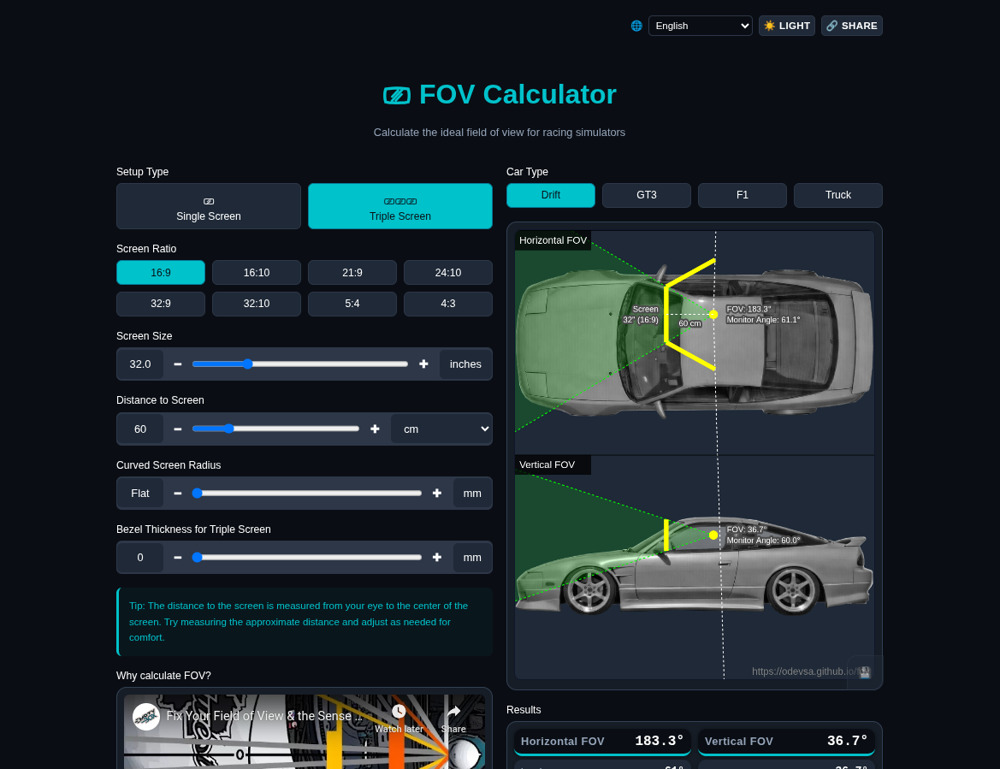

# FOV Calculator

Calculate horizontal and vertical field of view for racing simulators with support for single/triple screen setups and curved monitors.



## Online

https://odevsa.github.io/fov/

## Quick Start

```bash
python -m http.server 3000
```

Then open http://localhost:3000

## Features

- Accurate FOV calculation (flat & curved displays)
- Single/Triple screen support
- Multiple aspect ratios (16:9, 16:10, 21:9, 32:9, 4:3, etc)
- Unit conversion (cm/inches)
- Dark/Light theme
- 10 language support

## How to Use

1. Set screen ratio and size
2. Enter distance to screen
3. Choose single or triple screen setup
4. Enable curved screen if needed
5. Results update automatically

## Tech Stack

- HTML5 + CSS3 + Vanilla JavaScript
- No dependencies
